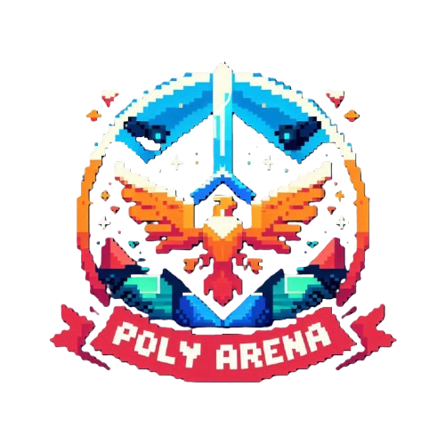

<div align="center">



# Poly Arena

**A real-time, cross-platform multiplayer tactics game — one authoritative server, three native clients.**

[](https://github.com/Ilyes-Jamoussi/cross-platform-multiplayer-game/actions/workflows/ci.yml)
[](LICENSE)


</div>

---

Poly Arena is a turn-based tactics game played on tile maps, where every match is
synchronized in real time across **web**, **Android**, and **desktop** players connected
to the same authoritative NestJS server. Build your own maps in the built-in editor,
fill lobbies with friends or AI opponents, and battle across four game modes.

## Features

- **Four game modes** — Classic free-for-all, Capture the Flag, Teams, and Fast Elimination
- **Full map editor** — hand-craft tile maps (walls, doors, items, spawn points) or generate boards procedurally, then publish them for everyone to play
- **Turn-based combat engine** — server-side movement, line-of-sight, combat resolution, escapes, items (potions, shields, poison, revive, dice…), and per-turn timers
- **AI opponents** — virtual players with distinct aggressive/defensive behavior profiles
- **Real-time everywhere** — Socket.IO gateways keep every client (web, mobile, desktop) in the same match, chat, and lobby state
- **Social layer** — accounts with Firebase Authentication, friends & friend requests, multi-channel chat (global, room, team) with a detachable chat window
- **Progression** — player profiles, match statistics, virtual currency, and a cosmetics shop (avatars, themes, music)
- **Internationalization** — English and French, switchable at runtime
- **Spectator mode** — join a running match as an observer

## Architecture

```
┌─────────────┐  ┌──────────────┐  ┌────────────────┐
│ Angular 19  │  │   Flutter    │  │    Electron    │
│ web client  │  │ mobile client│  │ desktop client │
└──────┬──────┘  └──────┬───────┘  └───────┬────────┘
       │   REST (HTTP)  │  WebSocket       │
       └────────────────┼──────────────────┘
                        ▼
              ┌───────────────────┐
              │   NestJS server   │  authoritative game state,
              │ Socket.IO gateways│  combat & movement engine,
              │  REST controllers │  matchmaking, chat, shop
              └────────┬──────────┘
                       │
            ┌──────────┴──────────┐
            ▼                     ▼
       ┌─────────┐         ┌────────────┐
       │ MongoDB │         │  Firebase  │
       │(Mongoose)│        │    Auth    │
       └─────────┘         └────────────┘
```

| Directory | Role |
|---|---|
| [`server/`](server) | NestJS + Socket.IO authoritative server: game logic, combat, movement, matchmaking, chat, friends, shop, stats. Swagger docs exposed at `/api/docs`. |
| [`client/`](client) | Angular 19 web client — game board, map editor, lobbies, profile, shop, admin tools. |
| [`mobile_client/`](mobile_client) | Flutter client for Android, sharing the same REST + WebSocket API. |
| [`desktop_electron/`](desktop_electron) | Electron shell that packages the production Angular build as a native desktop app (Windows/macOS/Linux). |
| [`common/`](common) | Shared TypeScript contracts — interfaces, enums, constants, and Socket.IO event names — imported by both client and server so the wire format can never drift. |

The server owns all game state: clients send intents (move, attack, use item) and
receive validated state updates, which keeps the three platforms consistent and
prevents client-side cheating.

## Getting started

### Prerequisites

- Node.js 20+
- MongoDB (local instance or [Atlas](https://www.mongodb.com/atlas))
- A [Firebase](https://console.firebase.google.com) project (Authentication enabled)
- Flutter SDK (only for the mobile client)

### 1. Server

```bash
cd server
npm ci
cp .env.example .env          # fill in MongoDB URI + Firebase service account
npm start                     # http://localhost:3000, Swagger at /api/docs
```

### 2. Web client

Paste your Firebase web-app config into
`client/src/app/services/auth-service/firebase.config.ts`, then:

```bash
cd client
npm ci
npm start                     # http://localhost:4200
```

### 3. Desktop client

```bash
cd desktop_electron
npm ci
npm run dev                   # builds the Angular app and launches Electron
npm run build                 # package installers (NSIS / dmg / AppImage)
```

### 4. Mobile client (Android)

```bash
cd mobile_client
flutter pub get
flutter run --dart-define=SERVER_HOST=10.0.2.2   # Android emulator → host machine
```

## Testing & CI

The repository carries **980+ unit tests** — a Jest suite on the server and a
Karma/Jasmine suite on the web client — **all passing**. Originally developed
against a GitLab CI pipeline, the project now runs a GitHub Actions workflow on
every push that executes both test suites, lints the web client, and builds the
production bundles.

```bash
cd server && npm test         # server unit tests (Jest)
cd client && npm test         # web client unit tests (Karma/Jasmine)
```

## About this project

Poly Arena was built over four months by a team of six as a software engineering
capstone project, and iterated on afterwards.

**My contributions** ([@Ilyes-Jamoussi](https://github.com/Ilyes-Jamoussi), ~52% of commits): led the Angular
web client end-to-end (game board, map editor, lobbies, shop, profile), implemented
major parts of the NestJS server (real-time gateways, game and combat logic), designed
the shared `common/` type layer, and maintained the CI pipeline.

## License

[MIT](LICENSE) © 2026 Ilyes Jamoussi and the Poly Arena contributors
